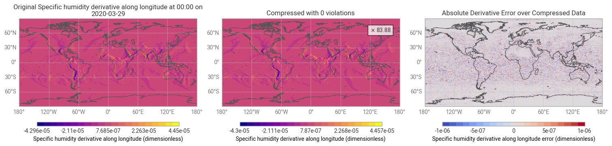

# Compression Lab Challenge Solutions

Reproducible, verified solutions for the challenges in the
[Online Laboratory for Data Compression in Climate Science and Meteorology](https://github.com/climet-eu/compression-lab-notebooks)
(ESiWACE3 / ECMWF compression hackathon).

**Author:** [@Lagnajee](https://github.com/Lagnajee)

Every entry below has **zero violations** under the challenge notebook's own
evaluation code, and every codec is rebuilt from its JSON config alone in CI.

| Challenge | Constraint | Notebook default | **This repo** | Leaderboard |
|---|---|---|---|---|
| [01 Missing values](configs/01-nan-missing-values.json) | \|error\| ≤ 1 kg m⁻², NaNs preserved | ZFP ×8.0 (68.7% violations) | **×42.80** | [#47](https://github.com/climet-eu/compression-lab-notebooks/issues/47) |
| [02 Relative error](configs/02-relative-error-bound.json) | \|error\| ≤ 1% of \|value\| | SZ3 ×142 (93.5% violations) | **×19.059** | [#48](https://github.com/climet-eu/compression-lab-notebooks/issues/48) |
| [03 Spatial gradient](configs/03-spatial-gradient.json) | \|error of d/dlon\| ≤ 1e-6 | SPERR ×1051 (14.2% violations) | **×83.876** | [#49](https://github.com/climet-eu/compression-lab-notebooks/issues/49) |



## Quick start

```shell
uv sync
bash scripts/download_data.sh      # ~72 MB, checksum-verified
uv run python verify.py            # rebuild codecs from configs/ and re-score
uv run python solve.py             # rebuild codecs from source, rewrite configs/ and leaderboard/
```

Leaderboard entries are collected in the Google Sheet linked from each
challenge's GitHub issue. [`leaderboard/`](leaderboard/) holds a ready-to-copy
row (ratio, version, full codec config) for each challenge.

## How each solution works

### 01 — Missing values (×42.80)
69% of the HOAPS water-vapour field is NaN, and the values are stored with
0.01 precision. A pointwise bound of 1 allows snapping every value to the
nearest multiple of 2, so the field collapses to ~40 distinct values.

1. `Round(precision=2)` rounds in floating point (worst-case error exactly 1) and leaves NaNs untouched.
2. `TokenizeCodec` maps the distinct values, NaN included, to uint8 indices.
3. Raw LZMA2 (`lc=4`, `pb=0`, no delta filter) compresses values and missingness as one stream.

Storing NaN as a token beats a separate NaN bitmap: the runner-up
(`MaskMetaCodec` + step-2 integer grid + byte-delta LZMA2) reaches ×39.76, and
restoring NaNs through safeguard corrections reaches only ×36.97. Every
floating-point compressor tried is far behind: SZ3 (×17–30), SPERR (×20),
EBCC (×21), LC (×21), BitRound+Zstd (×24), pcodec (×33).

### 02 — Pointwise relative error (×19.06)
A 1% relative bound is an absolute bound of `log2(1.01)` on `log2|x|`.
`PointwiseRatioErrorBoundedCodec` performs that transform and preserves zeros
and signs. Instead of SZ3 inside it (×18.06 with the `lorenzo` predictor), a
fixed quantiser with a step just below `2·log2(1.01)` stores int16 bins. LZMA2
with a 2-byte delta filter (`lc=1, lp=1, pb=1`) then exploits neighbour
correlation.

### 03 — Spatial gradient (×83.88)
The notebook's derivative divides by `(lon[i-5] - lon[i+5]) % 360`, which
evaluates to **357.5°**, not the 2.5° spacing it describes. The check is
therefore ~143× looser than intended. See [notes on the notebook](#notes-on-the-challenge-notebooks).

The solution targets the check exactly as written:

1. SPERR with a coarse quantisation step (`q=4.25e-4`) produces smooth, wavelet-shaped errors.
2. A `qoi_eb_stencil` safeguard encodes the exact QoI `(X[i-5] - X[i+5]) / 357.5` with periodic wrap and corrects the few points that would violate it.
3. LZMA compresses the combined stream.

Pointwise-bounded alternatives top out lower: SPERR `pwe` at ×81.2, SZ3 at ×61.6, quantise+LZMA at ×63.4.

## ERA5 challenges (04 pressure-level, 05 single-level)

These challenges have one leaderboard row per variable, and each variable has
its own safety requirements from
[`compression-recommendations`](https://github.com/juntyr/compression-recommendations).
Every exported codec passes the notebook's `check_safety_requirements` on the
one-timestep test subset.

- **Pressure-level (16 variables):** [`leaderboard/era5-pressure.md`](leaderboard/era5-pressure.md), [`results/era5_pressure.csv`](results/era5_pressure.csv)
- **Single-level (226 variables with requirements):** [`leaderboard/era5-single.md`](leaderboard/era5-single.md), [`results/era5_single.csv`](results/era5_single.csv)

The other 36 single-level variables (the vertical integrals `vi*`) have no
recommendation yet, so they cannot be scored.

### Results

| | Pressure-level | Single-level |
|---|---|---|
| Variables passing their requirements | 16 / 16 | 226 / 226 |
| Median compression ratio | ×55.7 | ×49.2 |
| Median of the `Safeguarded(Zero)` baseline | ×46.1 | ×22.9 |
| Median gain over the baseline | ×1.35 | ×1.86 |
| Variables at least 2× better than the baseline | 4 | 99 |
| Winning codec families | SPERR 9, log-ratio grid 5, safeguard-only 2 | mean-bound grid 211, pointwise grid 7, lossless 5, log-ratio grid 2, safeguard-only 1 |

Highlights: `t` ×787.7, `v` ×135.9, `z` ×132.2, `u` ×131.9 (pressure-level).
The weakest are relative-bound fields such as `d` ×13.5 and mean-absolute-bound
single-level fields such as `dl` ×8.1.

**Caveat on the largest single-level ratios.** Seven variables (`avg_esrwe`,
`csf`, `es`, `istl4`, `lgws`, `mgws`, `smlt`) exceed ×30,000 because their
field quantises to an almost constant grid while still meeting a mean error
bound that is large compared to the field itself. These entries are valid under
the published requirements, but they reflect how loose those requirements are
rather than compressor quality. They are good candidates for an issue or pull
request against `compression-recommendations`, as the challenge notebooks
suggest.

### Approach

The notebook baseline wraps a `ZeroCodec` in `safeguards_for_requirements(...)`.
That translation is conservative: a **mean** error bound becomes a **pointwise**
bound of the same size. The official check, however, tests the actual mean. The
sweep therefore builds candidates from each variable's requirement tree:

| Requirement | Candidates |
|---|---|
| Pointwise absolute `ε` | step-`2ε` integer grid + LZMA2, SZ3, SPERR; also wrapped in the full safeguards |
| Pointwise relative `ε` | log2 grid inside `PointwiseRatioErrorBoundedCodec` + LZMA2 (as in challenge 02) |
| Mean absolute `ε` | step-`2kε` grid, descending ladder `k = 16 … 1`; the first passing `k` is kept |
| Mean relative `ε` | absolute grid scaled by `ε·mean|x|`, and log2 grid with ratio `1 + kε` |
| Data limits | the candidates above, wrapped in only the data-limit safeguards |
| Lossless | LZMA2, integer tokens + LZMA2 |
| NaN present (e.g. ocean-wave fields) | NaN bitmap via `MaskMetaCodec` around the grid codecs |

The zero-anchored grid reproduces exact zeros, which contribute no error to a
mean bound, so mostly-zero fields (precipitation, cloud water) can use larger
grid steps than the uniform-error estimate suggests.

Reproduce or extend:

```shell
uv run python verify_era5.py               # all exported variables (streams fields from S3, cached in data/era5)
uv run python verify_era5.py single/2t     # one variable
uv run python scripts/export_era5.py --pressure exploration/era5/log04.json exploration/era5/log04b.json --single exploration/era5/results05 exploration/era5/results05_ext
```

## Repository layout

| Path | Contents |
|---|---|
| `src/hackathon/challenges.py` | Data loading and evaluation, copied verbatim from the notebooks' "do not edit" cells |
| `src/hackathon/codecs.py` | Builders for the winning codecs, with the reasoning for each |
| `configs/` | `codec.get_config()` for each winner, the leaderboard artefact |
| `leaderboard/` | Ready-to-copy Google Sheet rows (ratio, version, codec config) |
| `results/sweeps/` | Raw logs of ~900 exploration runs (codec, parameters, ratio, violations) |
| `results/figures/` | Comparison figures produced by the unmodified notebook plotting cells |
| `exploration/` | The sweep scripts that produced those logs (`exploration/era5/` for 04/05) |
| `configs/era5/` | Best codec config per ERA5 variable |
| `scripts/export_era5.py` | Turns ERA5 sweep logs into configs, tables and expected ratios |
| `verify_era5.py` | Rebuilds ERA5 codecs from `configs/era5/` and re-checks the safety requirements |

## Reproducibility notes

- Package versions are pinned to match `climet-eu/compression-lab-notebooks`
  `main` (e.g. `compression-safeguards==1.0.0rc3`).
- The notebooks load data through `ipyfilite`, which only works inside the
  browser lab. `challenges.py` reads byte-identical local copies instead;
  everything after loading is unchanged.
- The published online lab (`lab.climet.eu/v0.4.0`) ships older safeguards
  (`1.0.0b4`) and SPERR (`0.2.2`) packages. The 01 and 02 configs use only
  codecs that are present there (`numcodecs-wasm-round` 0.5.0,
  `numcodecs-tokenize` 0.1.3, `numcodecs-pw-ratio`, `lzma`, `zstd`). The 03
  config relies on the `1.0.0rc3` safeguards format and may not load in that
  older lab build.

## Notes on the challenge notebooks

- **03 gradient denominator:**
  `np.mod(da.lon.roll(lon=5) - da.lon.roll(lon=-5), 360)` evaluates to `357.5`
  for every point. Using `np.mod(da.lon.roll(lon=-5) - da.lon.roll(lon=5), 360)`
  (i.e. `2.5`) would match the comment `(x[i+5] - x[i-5]) / ...`. If the
  notebook is fixed, the 03 entry must be re-tuned.

## License

CC BY 4.0, matching the upstream laboratory. Challenge data © their respective
providers (HOAPS / EUMETSAT CM SAF, ECMWF, NextGEMS).
